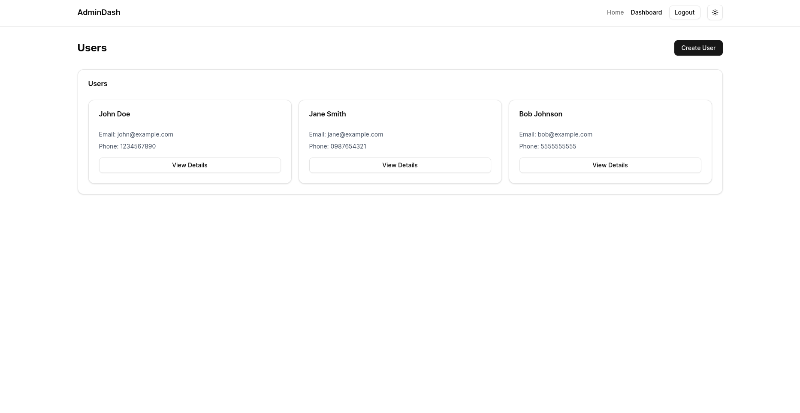

# Admin Dashboard with OTP Authentication



A modern admin dashboard with secure OTP authentication, user management, and responsive design built with Next.js, TypeScript, and shadcn/ui.

## Features

- 🔒 Secure OTP-based authentication flow
- 👥 User management (create, view, list)
- 🛡️ Protected routes with token-based auth
- 📱 Responsive design
- ✨ Modern UI with shadcn/ui components
- 🛠️ Type-safe with TypeScript

## Tech Stack

- **Framework**: [Next.js](https://nextjs.org/) (App Router)
- **Styling**: [Tailwind CSS](https://tailwindcss.com/)
- **UI Components**: [shadcn/ui](https://ui.shadcn.com/)
- **Authentication**: JWT with OTP
- **State Management**: React Context
- **Icons**: [Lucide](https://lucide.dev/)

## Getting Started

### Prerequisites

- Node.js (v18 or later)
- npm or yarn or bun
- Git

### Installation

1. Clone the repository:
   ```bash
   git clone https://github.com/shivamnarkar47/eazradmin.git
   cd admin-dashboard
   ```

2. Install dependencies:
   ```bash
   npm install
   # or
   yarn install
   # or
   bun install
   ```


3. Run the development server:
   ```bash
   npm run dev
   # or
   yarn dev
   # or 
   bun run dev
   ```

5. Open [http://localhost:3000](http://localhost:3000) in your browser.

## Usage

### Admin Credentials
For development purposes, use the following credentials:
- **Phone Number**: `7710957578`
- **OTP**: `7710`


### Features Overview

1. **Login Page** (`/admin/login`)
   - Enter admin contact number
   - Receive OTP (mock implementation)
   - Verify OTP to gain access

2. **Dashboard** (`/admin/dashboard`)
   - View all users
   - Create new users
   - Refresh user list
   - Logout functionality

3. **User Details** (`/admin/users/[id]`)
   - View detailed user information
   - Back to dashboard navigation

## API Endpoints

The project includes mock API endpoints:

- **Authentication**:
  - `POST /api/auth/admin/sendOtp` - Send OTP
  - `PUT /api/auth/admin/verifyOtp` - Verify OTP

- **Users**:
  - `GET /api/users` - List all users
  - `GET /api/users/[id]` - Get single user
  - `POST /api/users` - Create new user


## Customization

### Changing Admin Credentials
Edit the constants in `/src/lib/constants.ts`:
```typescript
export const ADMIN_CONTACT_NUMBER = "7710957578";
export const DEFAULT_OTP = "7710";
export const MOCK_TOKEN = "mock-admin-token-123";
```

### Styling
The project uses Tailwind CSS for styling. 


## Contact

Shivam Narkar - [@linuxious](https://x.com/linuxious) - shivamnarkar16@gmail.com

